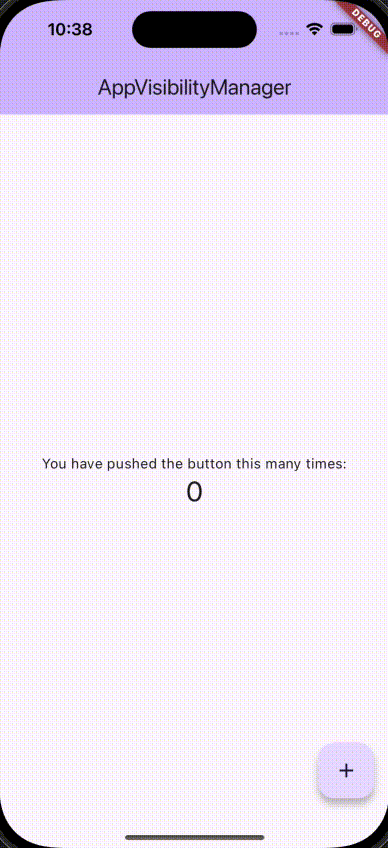

# AppVisibilityManager

AppVisibilityManager is a Flutter package that helps manage the visibility of the UI based on the app's lifecycle state. When the app goes into the background or becomes inactive, the UI can be hidden, and when it resumes, the UI is shown again.

## Features

- Automatically hides the UI when the app is inactive or paused.
- Shows a custom image when the UI is hidden.
- Resumes the UI visibility when the app is resumed.

## Installation

Add this to your package's `pubspec.yaml` file:

```yaml
dependencies:
  app_visibility_manager: ^1.0.0
```




```dart
class MyApp extends StatelessWidget {
  const MyApp({super.key});

  @override
  Widget build(BuildContext context) {
    return MaterialApp(
      title: 'AppVisibilityManager',
      theme: ThemeData(
        colorScheme: ColorScheme.fromSeed(seedColor: Colors.deepPurple),
        useMaterial3: true,
      ),
      home: const MyHomePage(title: 'AppVisibilityManager'),
      builder: (context, child) => AppVisibilityManager(
        image: const FlutterLogo(
          size: 72,
        ),
        child: child!,
      ),
    );
  }
}
```